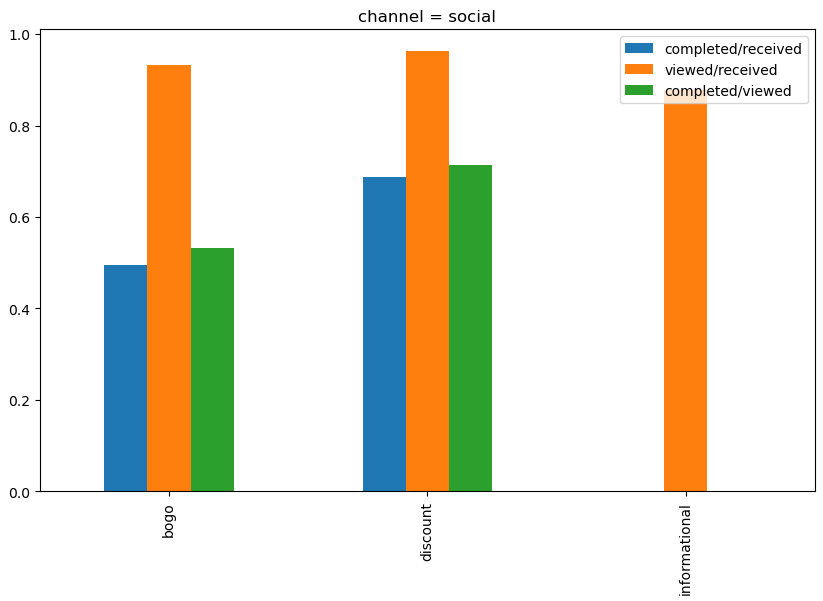

# Starbucks Capstone Challenge

## Description

- Using CRISP-DM to analyze Starbucks datasets. This dataset contains simulated data that mimics customer behavior on the Starbucks rewards mobile app. Once every few days, Starbucks sends out an offer to users of the mobile app. An offer can be merely an advertisement for a drink or an actual offer such as a discount or BOGO (buy one get one free). Some users might not receive any offer during certain weeks.

# Starbucks Promotional Analysis
We will use the CRISP-DM methodology for this analysis.

6 steps of CRISP-DM (Cross-Industry Standard Process for Data Mining):
1. Business Understanding
1. Data Understanding
1. Data Preparation
1. Modelling
1. Evaluation
1. Deployment

## Business Understanding
Starbucks has kindly provided simulated promotional datasets that mimic customer behavior on the rewards mobile app. The promotion runs like the following: once every few days, Starbucks will send out promotions to customers. The promotions could be discount offers, buy-one-get-one-free (bogo) offers, or informational offers. Different customers might react differently to the offers. Some customers will react positively to the promotions (viewed the offer and placed an order), whereas other customer might ignore the promotions (did not place an order after viewing the promotions, or placed an order without noticing the promotions). Since there is a cost associated with the promotion, analysis of the data could be helpful for understanding customer behaviors, making business decision, and implementing strategies to improve the business profits.

Let's answer 4 business questions:

- Was there a pattern in the release of offers?
- What were the most common offer types by channel?
- What is the best channel to send out promotions?
- Can we build a model to predict the customers' behavior and send out customized promotional offers to individuals?

## Resources used in development:
 - matplotlib==3.6.2
 - seaborn==0.12.2
 - pandas==1.5.2
 - numpy==1.25.1
 - scikit-learn==1.2.0
 - folium==0.14.0
 - jupyterlab==3.5.2
 - ydata-profiling==4.1.1

## Conclusion

### Question 1 - Was there a pattern in the release of offers? 

When we look at the distribution of time (converted to days) since test start, we can see clear spikes on days 0,7,14,21, etc. which suggests that the tests perhaps commence weekly or that there is clear scheduling behind receiving offers and completing offers.

### Question 2 - What were the most common offer types by channel?

- The most popular channels for bogo offers were email and mobile.
- The most popular channels for discount offers were email and web.
- The most popular channels for informational offers were email and mobile.

### Question 3 - What is the best channel to send out promotions? 

 - Promotion through social media is more effective than other channels

 ### Question 4 - Can we build a model to predict the customers' behavior and send out customized promotional offers to individuals?

 - Assuming we don't have the predictive model, we'll send offers to all customers. Of all observations, 42.6% were labeled “True”. The accuracy score in this case will be 0.426. Our implemented model will increase the accuracy score from 0.426 to 0.767, which is an absolute improvement of 34.1%.

 - So we can conclude that our model had a good effectiveness and improvement in the results of promotions, with this model in production we can increase the company's profits by 34.1%.

## Acknowledgement

 - https://towardsdatascience.com/crisp-dm-methodology-for-your-first-data-science-project-769f35e0346c
  - https://towardsdatascience.com/data-101s-spatial-visualizations-and-analysis-in-python-with-folium-39730da2adf
